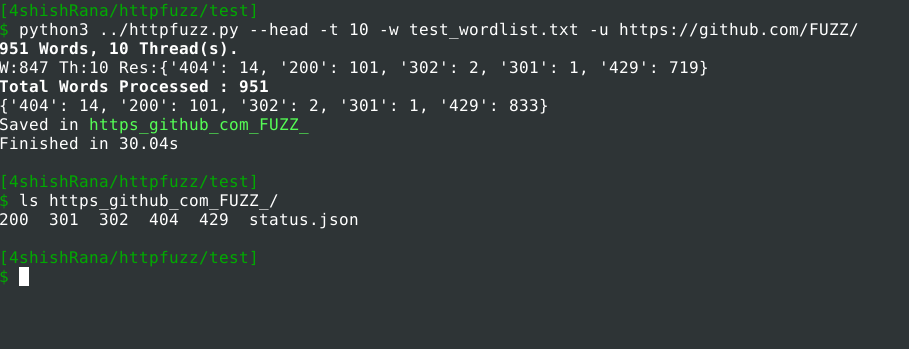

## httpfuzz
A simple HTTP directory fuzzer.

*Project is under Development*

This is the simplest HTTP directory Fuzzing tool,
With this tool you can,
  - Resume your fuzzing, after a break
  - Save all HTTP responses


httpfuzz USAGE
```
usage: httpfuzz.py [-h] [-w WORDLIST] [-u URL] [-H HEADER] [-t THREAD]
                   [-r REFRESH] [--redirect] [--cont] [--head]

optional arguments:
  -h, --help            show this help message and exit
  -w WORDLIST, --wordlist WORDLIST
                        Word List
  -u URL, --url URL     URL with FUZZ keyword
  -H HEADER, --header HEADER
                        Add Header to requests, 'name: value'
  -t THREAD, --thread THREAD
                        Threads Count
  -r REFRESH, --refresh REFRESH
                        Refresh time (sec) interval.
  --redirect            Follow Redirect
  --cont                Continue Previous Scan, if Any
  --head                Perform Fuzzing with HEAD requests


```
Example

`python3 ../httpfuzz.py --head -t 10 -w test_wordlist.txt -u https://github.com/FUZZ/`




Modification/Changes/ToDo
  - save full url in results
  - fix -w wordlist error

